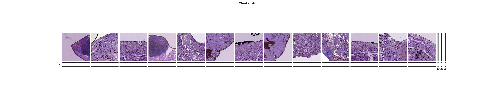
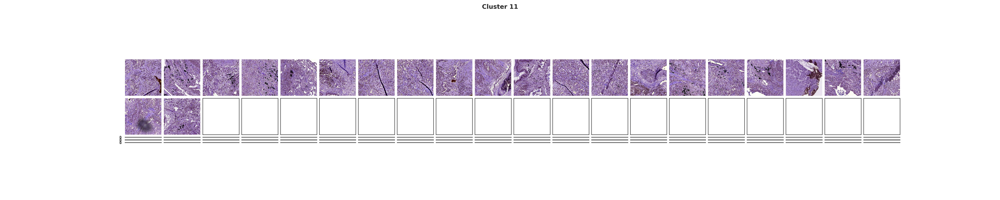
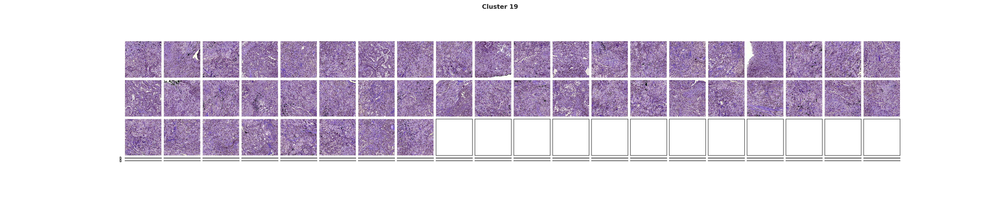

# **TCGA Lung Cancer Classification using InceptionV3 on NYU HPC**

## **Overview**
This repository contains a deep learning pipeline for training an **InceptionV3 model** on **TCGA lung cancer histopathology images**. The model classifies images into **LUAD (Lung Adenocarcinoma) or LUSC (Lung Squamous Cell Carcinoma)** using **TensorFlow, HDF5 datasets, and HPC clusters**.  

** Note:** This code is **specifically designed for NYU's HPC cluster** and requires modifications for use on other systems.

---

## **Project Status**
 **Data Processing**: Extracting slide-level images from HDF5 files  
 **Patient ID Mapping**: Linking slides to TCGA patient IDs  
 **Deep Learning Model**: InceptionV3 trained with **TFRecords**  
 **Cluster Analysis**: Identifying high-density tile clusters using **DBSCAN**  
  

---

## **Dataset**
We use the **TCGA lung cancer dataset**, which includes:
- **Histopathology slide images** stored in **HDF5 format**
- **Patient ID labels** for LUAD/LUSC classification
- **Tiling information** to reconstruct whole-slide images

---

## **Methods Implemented**
### **1️Data Preprocessing**
- **Extract images** from HDF5 files  
- **Normalize pixel intensities** for stable training  
- **Assign labels** to patient slides (LUAD/LUSC)  
- **Split data** into Train, Validation, and Test  

### ** Deep Learning Model**
- **Architecture**: InceptionV3 (pretrained weights removed)  
- **Augmentation**: Random flips, rotations, contrast adjustments  
- **Loss Function**: Binary Cross-Entropy  
- **Optimizer**: SGD with momentum  
- **Evaluation**: AUC-ROC and accuracy  

### ** HPC-Specific Optimization**
- **TFRecords** to handle large datasets  
- **Multi-GPU training** (NYU HPC)  
- **Batch-wise data loading** for memory efficiency  

### ** Tile Clustering & Visualization**
- **DBSCAN clustering** for identifying meaningful regions  
- **Mask verification** to ensure correct label mappings  
- **Slide-wise reconstructions** from tile coordinates  

---

###  Visualizations

#### 🔹 Clustered Patches – Training  

Clusters identified from training tiles using DBSCAN. These clusters highlight high-density regions in the tissue, such as tumor cores or lymphocyte aggregates.

---

####  Clustered Patches – Testing  

Testing slide cluster visualizations used to evaluate how the model generalizes across patient samples.

---

####  Cluster Heatmaps (Test Samples)  
  

Two test samples showing spatial grouping of histological tiles. These clusters can be used to correlate with morphology or subtype-specific patterns.

---

#### Slide-Level Patch Mask  

Binary mask showing regions of interest extracted from a whole-slide image. This helps isolate cancerous regions from background tissue.

---

#### Transformed Region (Data Augmentation Preview)  

Example of a tile after applying augmentation such as flipping, random rotation, and contrast adjustment — part of the TFRecord preprocessing pipeline.

---

