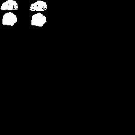
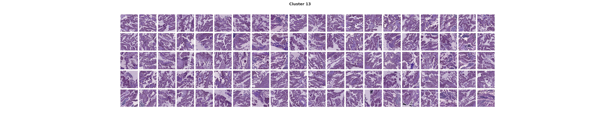
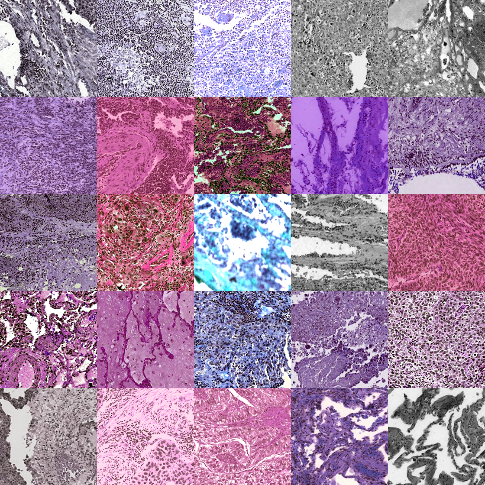

# TCGA Lung Cancer Classification using InceptionV3 on NYU HPC

## Overview

This repository implements a deep learning pipeline for classifying lung cancer subtypes — **LUAD (Lung Adenocarcinoma)** vs **LUSC (Lung Squamous Cell Carcinoma)** — from histopathology whole-slide images (WSIs) using a modified **InceptionV3** model trained on self-supervised embeddings, running on NYU's HPC cluster.

It builds upon the **Histomorphological Phenotype Learning (HPL)** framework introduced in:

> Quiros et al., *"Mapping the landscape of histomorphological cancer phenotypes using self-supervised learning on unannotated pathology slides"*, Nature Communications, 2024.

The HPL paper uses SSL to discover unsupervised tissue phenotypes and applies logistic regression for classification. **This work extends that pipeline by training a deep learning classifier (InceptionV3) directly on the SSL tile embeddings**, testing whether a neural network can outperform the cluster-based approach.

---

## Dataset

- **Source**: TCGA Lung Adenocarcinoma (LUAD) and Lung Squamous Cell Carcinoma (LUSC)
- **Format**: Whole Slide Images (WSIs), tiled into 224×224 patches
- **Tile Embeddings**: 128D vectors from a pretrained Barlow Twins SSL model
- **Scale**:

| Split      | Tiles   | Slides |
|------------|---------|--------|
| Train      | 537,474 | 628    |
| Validation | 154,240 | 197    |
| Test       | 149,265 | 197    |

- Balanced label distribution across LUAD and LUSC (upsampling applied to minority class)

---

## HPL Background

The HPL paper introduced a fully unsupervised framework — **Histomorphological Phenotype Learning** — for discovering morphological patterns in WSIs without requiring expert annotations.

[](images/hpl_overview.png)


### HPL Pipeline (Prior Work)

**Step 1 — WSI Preprocessing**: WSIs are split into 224×224 tiles. Background tiles are removed using tissue masks. Stain normalization corrects for lab-to-lab variation in H&E staining.

**Step 2 — Self-Supervised Representation Learning**: Barlow Twins is trained without labels on the full tile set, producing 128D embeddings per tile that capture morphological structure and texture.

**Step 3 — Tile Clustering (HPCs)**: 200,000 tile embeddings are sampled, reduced with UMAP, and clustered via Leiden over a KNN graph (K=250). This produces **46 Histomorphological Phenotype Clusters (HPCs)**, each representing a distinct tissue pattern.

**Step 4 — Slide-Level Aggregation**: Each slide is represented as a vector of HPC proportions — what percentage of its tiles fall into each cluster.

**Step 5 — Downstream Tasks**: Logistic Regression on HPC proportion vectors achieves AUC = **0.93** (TCGA) and **0.99** (NYU) for LUAD vs LUSC classification.

---

## My Contribution: InceptionV3 Classifier on SSL Embeddings

Rather than using cluster proportions as slide-level features, this project feeds the raw 128D tile embeddings directly into a modified InceptionV3 model, treating each slide as a (224×224×128) tensor.

### Methodology

#### Tile Aggregation
- Tiles grouped by slide ID
- Reconstructed into **(224 × 224 × 128)** tensors treating embedding dimensions as channels
- These tensors are the input to the CNN

#### InceptionV3 Architecture (Modified)

| Layer | Config |
|-------|--------|
| Input shape | (224, 224, 128) |
| Base | InceptionV3, `include_top=False`, `weights=None` |
| Pooling | GlobalAveragePooling2D |
| Dense | 512 units, ReLU |
| Regularization | Dropout(0.5) |
| Output | Dense(1, Sigmoid) |

> `weights=None` — ImageNet pretraining not used because input has 128 channels, not 3.

#### Training Setup

| Parameter | Value |
|-----------|-------|
| Optimizer | SGD with momentum (0.9), Nesterov |
| Learning Rate | 0.01 |
| Loss | Binary Crossentropy |
| Evaluation | Accuracy, AUC |
| Hardware | NYU HPC, multi-GPU |

---

## Results

| Metric   | This Work (InceptionV3) | HPL Baseline (Logistic Regression) |
|----------|------------------------|--------------------------------------|
| Accuracy | ~78%                   | —                                    |
| AUC      | ~0.65                  | 0.93 (TCGA), 0.99 (NYU)             |

The simpler cluster-based approach outperforms the deep model. The HPL pipeline uses structured, biology-grounded HPC proportion vectors as features, while InceptionV3 trains from scratch with no inductive bias suited to embedding tensors. End-to-end fine-tuning of the SSL backbone together with the classifier would likely close this gap.

---

## Visual Examples

**Tissue mask and patch extraction:**

[](images/TCGA-33-4532-01Z-00-DX1_mask.png)

**Example cluster tiles (Cluster 13):**

[](images/cluster_13_train.jpg)

**Transformed input tiles:**

[](images/transformed_1.png)

---

## Learnings

- SSL embeddings encode rich morphological information but lose the spatial structure that CNNs are designed to exploit — explaining the lower AUC vs logistic regression on HPC proportions
- Class imbalance at the tile level significantly affects convergence; upsampling the minority class was necessary for stable training
- HDF5-based tile storage was essential for I/O efficiency at 850K+ tile scale
- SLURM job scripting on shared HPC infrastructure requires careful memory and GPU allocation to avoid preemption

## Future Directions

- Add attention-based or MIL aggregation methods for slide-level representation
- Fine-tune SSL backbone and classifier jointly (end-to-end)
- Integrate multimodal features (genomics, RNA-seq, clinical metadata)

---

## Citation

```bibtex
@article{QuirosCoudray2024,
  author  = {Claudio Quiros, Adalberto and Coudray, Nicolas and Yeaton, Anna and Yang, Xinyu and Liu, Bojing and Le, Hortense and Chiriboga, Luis and Karimkhan, Afreen and Narula, Navneet and Moore, David A. and Park, Christopher Y. and Pass, Harvey and Moreira, Andre L. and Le Quesne, John and Tsirigos, Aristotelis and Yuan, Ke},
  journal = {Nature Communications},
  number  = {1},
  pages   = {4596},
  title   = {Mapping the landscape of histomorphological cancer phenotypes using self-supervised learning on unannotated pathology slides},
  volume  = {15},
  year    = {2024}
}
```
